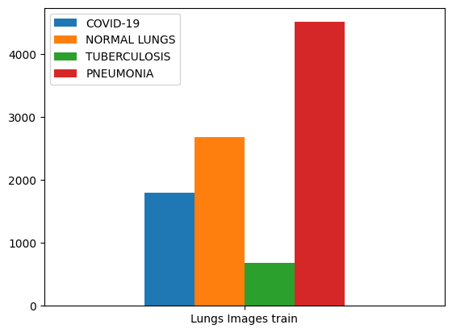
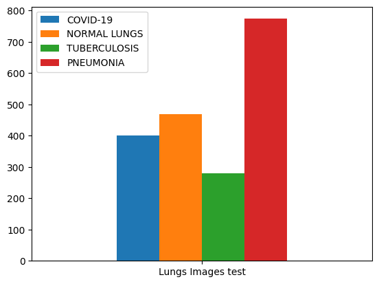
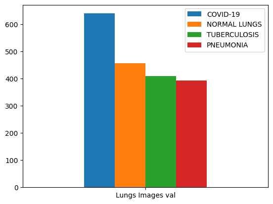

# **HealthAI** _The project is under development_

## **Used technology stack:**

## **Data link**:

https://drive.google.com/drive/folders/1PHT2ZVzbfxccRnOb5tl2r4Enrk7YXlMP?usp=share_link

## **Idea of project**:

My project is a system based on neural networks that allows you to quickly and accurately identify possible lung diseases from photographs. The system is able to detect such dangerous diseases as pneumonia, tuberculosis and coronavirus, which will help doctors quickly and accurately diagnose and prescribe the necessary treatment.

## **1) Data analysis**

The entire dataset was compiled from various datasets from Kaggle.com. At the moment, the dataset consists of four classes:

- Pneunomia
- Covid-19
- Normal
- Tuberculosis

Unfortunately, medical data is a very valuable resource that is very difficult to find unless you work with a medical company, so there is a rather strong class imbalance in the first version.

In order to get rid of it, it was decided to equalize the number of elements in each class according to the minimum number.

## **3) Results**

LungsModel V2 is currently being trained

